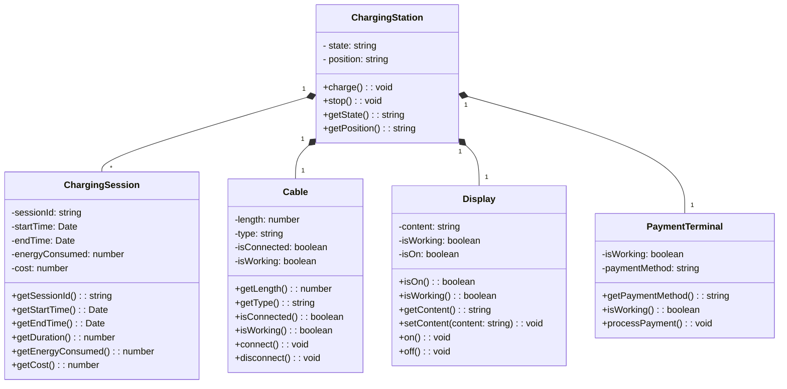

```mermaid
classDiagram
    class ChargingStation {
        - state: string
        - position: string
        +charge(): void
        +stop(): void
        +getState(): string
        +getPosition(): string
    }

    class ChargingSession {
        -sessionId: string
        -startTime: Date
        -endTime: Date
        -energyConsumed: number
        -cost: number
        +getSessionId(): string
        +getStartTime(): Date
        +getEndTime(): Date
        +getDuration(): number
        +getEnergyConsumed(): number
        +getCost(): number
    }
    ChargingStation "1" *-- "*" ChargingSession

    class Cable {
        -length: number
        -type: string
        -isConnected: boolean
        -isWorking: boolean
        +getLength(): number
        +getType(): string
        +isConnected(): boolean
        +isWorking(): boolean
        +connect(): void
        +disconnect(): void
    }
    ChargingStation "1" *-- "1" Cable

    class Display {
        -content: string
        -isWorking: boolean
        -isOn: boolean
        +isOn(): boolean
        +isWorking(): boolean
        +getContent(): string
        +setContent(content: string): void
        +on(): void
        +off(): void
    }
    ChargingStation "1" *-- "1" Display

    class PaymentTerminal {
        -isWorking: boolean
        -paymentMethod: string
        +getPaymentMethod(): string
        +isWorking(): boolean
        +processPayment(): void
    }
    ChargingStation "1" *-- "1" PaymentTerminal
```
