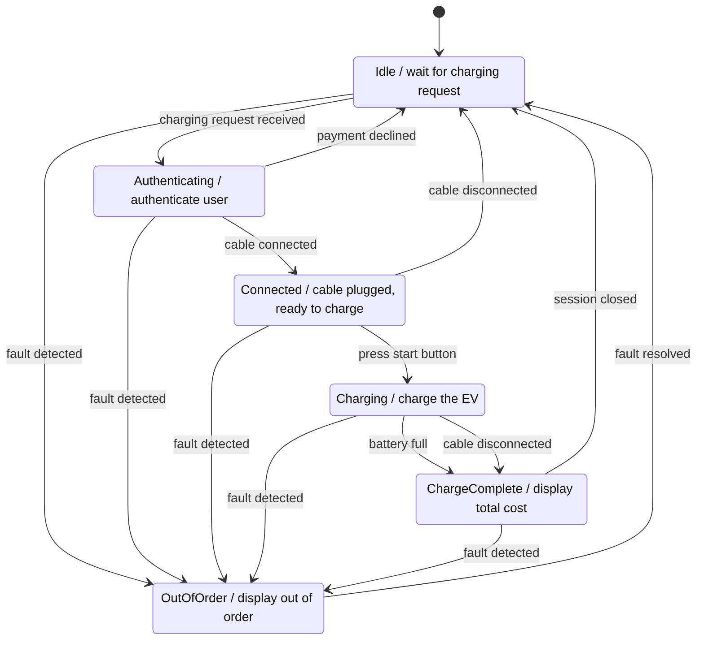

```mermaid
stateDiagram-v2
    [*] --> Idle
    Idle : Idle / wait for charging request
    Idle --> Authenticating : charging request received
    Idle --> OutOfOrder : fault detected

    Authenticating : Authenticating / authenticate user
    Authenticating --> Connected : cable connected
    Authenticating --> Idle : payment declined
    Authenticating --> OutOfOrder : fault detected

    Connected : Connected / cable plugged, ready to charge
    Connected --> Charging : press start button
    Connected --> Idle : cable disconnected
    Connected --> OutOfOrder : fault detected

    Charging : Charging / charge the EV
    Charging --> ChargeComplete : battery full
    Charging --> ChargeComplete : cable disconnected
    Charging --> OutOfOrder : fault detected

    ChargeComplete : ChargeComplete / display total cost
    ChargeComplete --> Idle : session closed
    ChargeComplete --> OutOfOrder : fault detected

    OutOfOrder : OutOfOrder / display out of order
    OutOfOrder --> Idle : fault resolved
```
