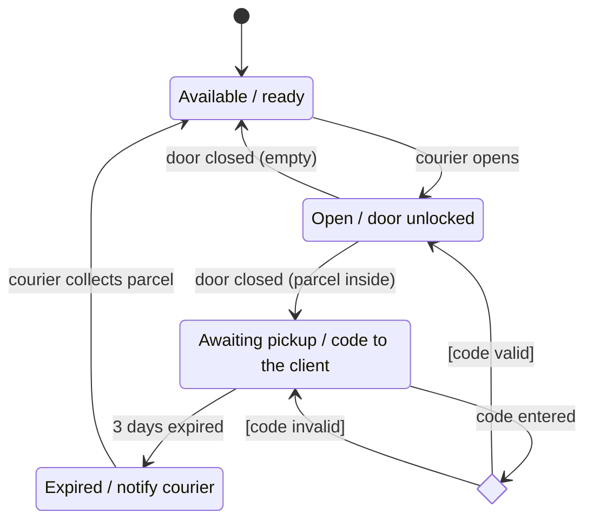

```mermaid
stateDiagram-v2
    [*] --> Available
    Available : Available / ready
    Available --> Open : courier opens
    Open : Open / door unlocked
    Open --> AwaitingPickup : door closed (parcel inside)
    AwaitingPickup : Awaiting pickup / code to the client
   AwaitingPickup --> Expired : 3 days expired
   Expired : Expired / notify courier
   Expired --> Available : courier collects parcel
    state check_code <<choice>>
    AwaitingPickup --> check_code : code entered
   check_code --> Open : [code valid]
   check_code --> AwaitingPickup : [code invalid]
   Open --> Available : door closed (empty)
```
