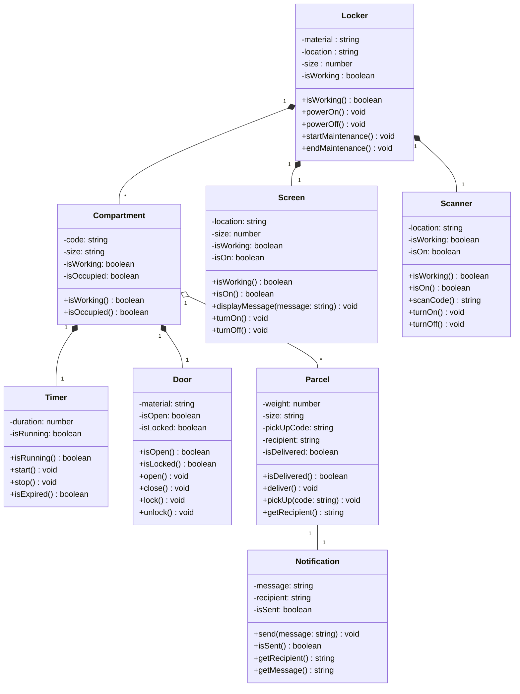

```mermaid
classDiagram
    class Locker {
        -material : string
        -location : string
        -size : number
        -isWorking : boolean
        +isWorking() boolean
        +powerOn() void
        +powerOff() void
        +startMaintenance() void
        +endMaintenance() void
    }

    class Compartment {
        -code: string
        -size: string
        -isWorking: boolean
        -isOccupied: boolean
        +isWorking() boolean
        +isOccupied() boolean
    }

    Locker "1" *-- "*" Compartment

    class Screen {
        -location: string
        -size: number
        -isWorking: boolean
        -isOn: boolean
        +isWorking() boolean
        +isOn() boolean
        +displayMessage(message: string) void
        +turnOn() void
        +turnOff() void
    }

    Locker "1" *-- "1" Screen

    class Scanner {
        -location: string
        -isWorking: boolean
        -isOn: boolean
        +isWorking() boolean
        +isOn() boolean
        +scanCode() string
        +turnOn() void
        +turnOff() void
    }

    Locker "1" *-- "1" Scanner

    class Timer {
        -duration: number
        -isRunning: boolean
        +isRunning() boolean
        +start() void
        +stop() void
        +isExpired() boolean
    }

    Compartment "1" *-- "1" Timer

    class Door {
        -material: string
        -isOpen: boolean
        -isLocked: boolean
        +isOpen() boolean
        +isLocked() boolean
        +open() void
        +close() void
        +lock() void
        +unlock() void
    }

    Compartment "1" *-- "1" Door

    class Parcel {
        -weight: number
        -size: string
        -pickUpCode: string
        -recipient: string
        -isDelivered: boolean
        +isDelivered() boolean
        +deliver() void
        +pickUp(code: string) void
        +getRecipient() string
    }

    Compartment "1" o-- "*" Parcel

    class Notification {
        -message: string
        -recipient: string
        -isSent: boolean
        +send(message: string) void
        +isSent() boolean
        +getRecipient() string
        +getMessage() string
    }

    Parcel "1" -- "1" Notification
    
```
