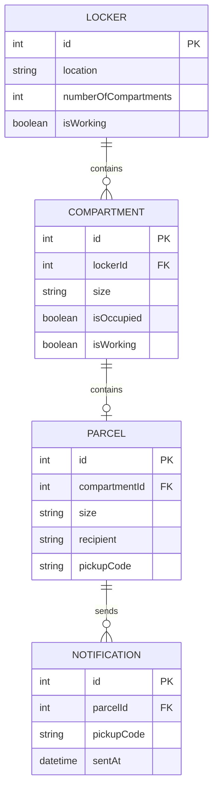

```mermaid
erDiagram
LOCKER {
        int id PK
        string location
        int numberOfCompartments
        boolean isWorking
    }

COMPARTMENT {
        int id PK
        int lockerId FK
        string size
        boolean isOccupied
        boolean isWorking
    }

LOCKER ||--o{ COMPARTMENT : contains

PARCEL {
    int id PK
    int compartmentId FK
    string size
    string recipient
    string pickupCode
}
COMPARTMENT ||--o| PARCEL : contains

NOTIFICATION {
    int id PK
    int parcelId FK
    string pickupCode
    datetime sentAt
}
PARCEL ||--o{ NOTIFICATION : sends

```
