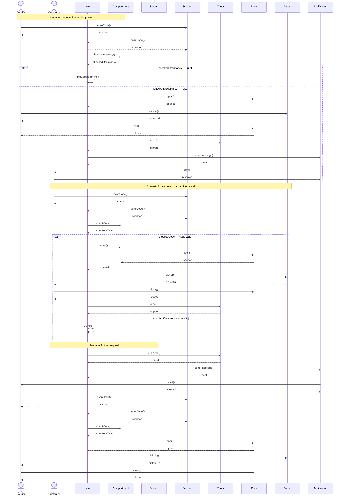

```mermaid
sequenceDiagram

actor CO as Courier
actor CL as Customer
participant L as Locker
participant CM as Compartment
participant S as Screen
participant SC as Scanner
participant T as Timer
participant D as Door
participant P as Parcel
participant N as Notification


Note over CO,CM: Scenario 1: courier leaves the parcel
CO->>SC: scanCode()
SC-->>CO: scanned
SC->>L: scanCode()
L-->>SC: scanned
L->>CM: checkOccupancy()
CM-->>L: checkedOccupancy

alt checkedOccupancy == true
    L->>L: findCompartment()
else checkedOccupancy == false
    L->>D: open()
    D-->>L: opened
    CO->>P: deliver()
    P-->>CO: delivered
    CO->>D: close()
    D-->>CO: closed
    L->>T: start()
    T-->>L: started
    L->>N: send(message)
    N-->>L: sent
    N->>CL: send()
    CL-->>N: received
end

Note over CL,P: Scenario 2: customer picks up the parcel
CL->>SC: scanCode()
SC-->>CL: scanned
SC->>L: scanCode()
L-->>SC: scanned
L->>CM: checkCode()
CM-->>L: checkedCode
alt checkedCode == code valid
    L->>CM: open()
    CM->>D: open()
    D-->>CM: opened
    CM-->>L: opened
    CL->>P: pickUp()
    P-->>CL: pickedUp
    CL->>D: close()
    D-->>CL: closed
    L->>T: stop()
    T-->>L: stopped
    
else checkedCode == code invalid
    L->>L: reject()
end

Note over CL,S: Scenario 3: timer expired
L->>T: isExpired()
T-->>L: expired
L->>N: send(message)
N-->>L: sent
N->>CO: send()
CO-->>N: received
CO->>SC: scanCode()
SC-->>CO: scanned
SC->>L: scanCode()
L-->>SC: scanned
L->>CM: checkCode()
CM-->>L: checkedCode
L->>D: open()
D-->>L: opened
CO->>P: pickUp()
P-->>CO: pickedUp
CO->>D: close()
D-->>CO: closed
```