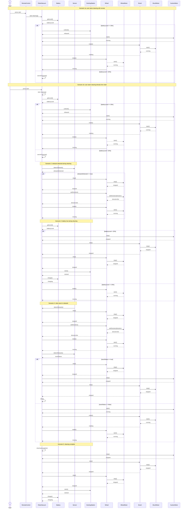

```mermaid
sequenceDiagram
    
actor U as User
participant RC as RemoteControl
participant RV as RobotVacuum
participant B as Battery
participant S as Sensor
participant DS as DockingStation
participant W as Wheel
participant WM as WheelMotor
participant BR as Brush
participant BM as BrushMotor
participant SM as SuctionMotor

Note over U,SM: Scenario 1a: user starts cleaning with remote
U->>RC: press start
RC->>RV: start cleaning()
RV->>B: getLevel()
B-->>RV: batteryLevel

alt batteryLevel >= 30%
    RV->>DS:undock()
    DS-->>RV:released
    RV->>SM:start()
    SM-->>RV:running
    RV->>BR:rotate()
    BR->>BM:start()
    BM-->>BR:running
    BR-->>RV:rotating
    RV->>W: rotate()
    W-->>WM:start()
    WM-->>W:running
    W->>RV:moving
else batteryLevel < 30%
    RV ->> RV : cancelCleaning()
end

Note over U,SM: Scenario 1b: user starts cleaning directly from robot
U->>RV: press start
RV->>RV: start cleaning()
RV->>B: getLevel()
B-->>RV: batteryLevel

alt batteryLevel >= 30%
    RV->>DS:undock()
    DS-->>RV:released
    RV->>SM:start()
    SM-->>RV:running
    RV->>BR:rotate()
    BR->>BM:start()
    BM-->>BR:running
    BR-->>RV:rotating
    RV->>W: rotate()
    W-->>WM:start()
    WM-->>W:running
    W->>RV:moving
else batteryLevel < 30%
    RV ->> RV : cancelCleaning()
end

Note over RV,S: Scenario 2: obstacle detected during cleaning

RV ->>S:detectObstacle()
S-->>RV:obstacleDetected

alt obstacleDetected == true
    RV->>W: stop()
    W->>WM:stop()
    WM-->>W: stopped
    W-->>RV: stopped
    RV->>W: setDirection()
    W->>WM: setDirection(direction)
    WM-->>W: directionSet
    W-->>RV: directionSet
    RV->>W: rotate()
    W->>WM: start()
    WM-->>W: running
    W-->>RV: moving
end


Note over RV,DS: Scenario 3: battery low during cleaning
RV->>B: getLevel()
B-->>RV: batteryLevel

alt batteryLevel < 20%
    RV->>SM:stop()
    SM-->>RV:stopped
    RV->>BR:stop()
    BR->>BM:stop()
    BM-->>BR:stopped
    BR-->>RV:stopped
    RV->>W: stop()
    W->>WM:stop()
    WM-->>W: stopped
    W-->>RV: stopped
    RV->>DS: dock()
    DS-->>RV: docked
    RV->>B:charge()
    B-->>RV: charging
else batteryLevel >= 30%
    RV->>W:rotate()
    W-->>WM:start()
    WM-->>W:running
    W-->>RV:moving
end

Note over RV,S: Scenario 4: robot stuck in obstacle
S->>RV: detectObstacle()
RV->>W: stop()
W->>WM: stop()
WM-->>W: stopped
W-->>RV: stopped
RV->>W: setDirection()
W->>WM: setDirection(direction)
WM-->>W: directionSet
W-->>RV: directionSet
RV->>W: rotate()
W->>WM: start()
WM-->>W: running
W-->>RV: moving
RV->>S: detectObstacle()
S-->>RV: stuckStatus

alt stuckStatus == true
   RV->>W: stop()
   W->>WM: stop()
   WM-->>W: stopped
   W-->>RV: stopped
   RV->>SM: stop()
   SM-->>RV: stopped
   RV->>BR: stop()
   BR->>BM: stop()
   BM-->>BR: stopped
   BR-->>RV: stopped
   RV->>RV: alert()
else stuckStatus == false
   RV->>SM: start()
   SM-->>RV: running
   RV->>BR: rotate()
   BR->>BM: start()
   BM-->>BR: running
   BR-->>RV: rotating
   RV->>W: rotate()
   W->>WM: start()
   WM-->>W: running
   W-->>RV: moving
end

Note over RV,DS: Scenario 5: cleaning complete
RV->>RV: cleaningComplete()
RV->>SM: stop()
SM-->>RV: stopped
RV->>BR:stop()
    BR->>BM:stop()
    BM-->>BR:stopped
    BR-->>RV:stopped
    RV->>W: stop()
    W->>WM:stop()
    WM-->>W: stopped
    W-->>RV: stopped
    RV->>DS: dock()
    DS-->>RV: docked
    RV->>B:charge()
    B-->>RV: charging
```
