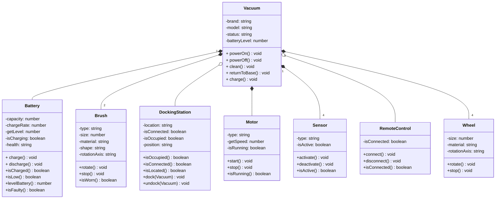

```mermaid
classDiagram
    class Vacuum {
        -brand: string
        -model: string
        -status: string
        -batteryLevel: number
        + powerOn()void
        + powerOff()void
        + clean()void
        + returnToBase()void
        + charge()void
    }

    class Battery {
        -capacity: number
        -chargeRate: number
        -getLevel: number
        -isCharging: boolean
        -health: string
        + charge()void
        + discharge()void
        +isCharged() boolean
        +isLow() boolean
        +levelBattery() number
        +isFaulty() boolean
    }
    Vacuum *-- Battery

    class Brush {
        -type: string
        -size: number
        -material: string
        -shape: string
        -rotationAxis: string
        +rotate() void
        +stop() void
        +isWorn() boolean
    }
    Vacuum "1" *-- "2" Brush

    class DockingStation {
        -location: string
        -isConnected: boolean
        -isOccupied: boolean
        -position: string
        +isOccupied() boolean
        +isConnected() boolean
        +isLocated() boolean
        +dock(Vacuum) void
        +undock(Vacuum) void
    }
    Vacuum o-- DockingStation

    class Motor {
        -type: string
        -getSpeed: number
        -isRunning: boolean
        +start() void
        +stop() void
        +isRunning() boolean
    }
    Vacuum *-- Motor

    class Sensor {
        -type: string
        -isActive: boolean
        +activate() void
        +deactivate() void
        +isActive() boolean
        
    }
    Vacuum "1" *-- "4" Sensor

    class RemoteControl {
        -isConnected: boolean
        +connect() void
        +disconnect() void
        +isConnected() boolean
        
    }
    Vacuum o-- RemoteControl

    class Wheel {
        -size: number
        -material: string
        -rotationAxis: string
        +rotate() void
        +stop() void
        
    }
    Vacuum "1" *-- "4" Wheel
```