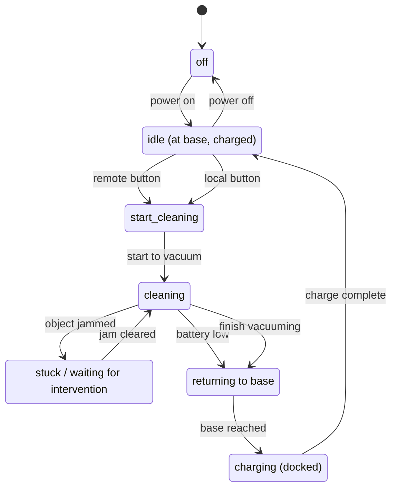

```mermaid
stateDiagram-v2
[*] --> off
off --> idle : power on
idle --> off : power off
idle : idle (at base, charged)

%% CLEANING
idle --> start_cleaning : remote button
idle --> start_cleaning : local button
start_cleaning --> cleaning : start to vacuum

%% STUCK
cleaning --> stuck : object jammed
stuck : stuck / waiting for intervention
stuck --> cleaning : jam cleared

%% RETURN TO BASE (sia batteria scarica che fine pulizia)
cleaning --> returning_to_base : battery low
cleaning --> returning_to_base : finish vacuuming
returning_to_base : returning to base

returning_to_base --> charging : base reached
charging : charging (docked)
charging --> idle : charge complete
```
