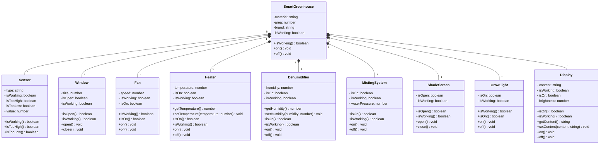

```mermaid
classDiagram
    class SmartGreenhouse {
        -material: string
        -area: number
        -brand: string
        -isWorking: boolean
        +isWorking() boolean
        +on() void
        +off() void
    }

    class Sensor {
        - type: string
        - isWorking: boolean
        - isTooHigh: boolean
        - isTooLow: boolean
        - value: number
        +isWorking() boolean
        +isTooHigh() boolean
        +isTooLow() boolean
    }
    SmartGreenhouse "1" *-- "*" Sensor

    class Window {
        -size: number
        -isOpen: boolean
        -isWorking: boolean
        +isOpen() boolean
        +isWorking() boolean
        +open() void
        +close() void
    }
    SmartGreenhouse "1" *-- "*" Window

    class Fan {
        - speed: number
        - isWorking: boolean
        - isOn: boolean
        +isWorking() boolean
        +isOn() boolean
        +on() void
        +off() void
    }
    SmartGreenhouse "1" *-- "*" Fan

    class Heater {
        - temperature: number
        - isOn: boolean
        - isWorking: boolean
        +getTemperature() number
        +setTemperature(temperature: number) void
        +isOn() boolean
        +isWorking() boolean
        +on() void
        +off() void
    }
    SmartGreenhouse "1" *-- "1" Heater

    class Dehumidifier {
        - humidity: number
        - isOn: boolean
        - isWorking: boolean
        +getHumidity() number
        +setHumidity(humidity: number) void
        +isOn() boolean
        +isWorking() boolean
        +on() void
        +off() void
    }
    SmartGreenhouse "1" *-- "1" Dehumidifier

    class MistingSystem {
        - isOn: boolean
        - isWorking: boolean
        - waterPressure: number
        +isOn() boolean
        +isWorking() boolean
        +on() void
        +off() void
    }
    SmartGreenhouse "1" *-- "1" MistingSystem

    class ShadeScreen {
        - isOpen: boolean
        - isWorking: boolean
        +isOpen() boolean
        +isWorking() boolean
        +open() void
        +close() void
    }
    SmartGreenhouse "1" *-- "1" ShadeScreen

    class GrowLight {
        - isOn: boolean
        - isWorking: boolean
        +isWorking() boolean
        +isOn() boolean
        +on() void
        +off() void
    }
    SmartGreenhouse "1" *-- "*" GrowLight

    class Display {
        - content: string
        - isWorking: boolean
        - isOn: boolean
        - brightness: number
        +isOn() boolean
        +isWorking() boolean
        +getContent() string
        +setContent(content: string) void
        +on() void
        +off() void
    }
    SmartGreenhouse "1" *-- "1" Display
```
