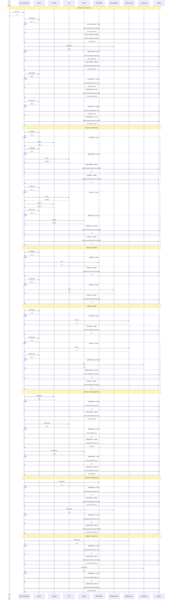

```mermaid
sequenceDiagram
    actor U as User
    participant SG as Smart Greenhouse
    participant S as Sensor
    participant W as Window
    participant F as Fan
    participant H as Heater
    participant DH as Dehumidifier
    participant MS as Misting System
    participant SS as Shade Screen
    participant GL as Grow Light
    participant D as Display

Note over U,D: Scenario 1: User turns on
   U->>SG: turn on()
   SG-->>U: on
   SG->>S: isWorking()
   S-->>SG: true
alt sensor working == true
  SG->>D: setContent(all sensors active)
  D-->>SG: all sensors active
else sensor working == false
  SG->>D: setContent(sensor failed)
  D-->>SG: sensor failure
end
SG->>MS: isWorking()
MS-->>SG: true
alt water supply == true
  SG->>D: setContent(water supply ok)
  D-->>SG: water supply ok
else water supply == false
  SG->>D: setContent(water supply lost)
  D-->>SG: water supply lost
end
SG->>S: isTooHigh()
S-->>SG: false 
alt temperature == false
  SG->>D: setContent(temperature ok)
  D-->>SG: temperature ok
else temperature == true
  SG->>D: setContent(temperature critical)
  D-->>SG: temperature critical
end
SG->>S: isTooLow()
S-->>SG: false
alt temperature == false
  SG->>D: setContent(temperature ok)
  D-->>SG: temperature ok
else temperature == true
  SG->>D: setContent(temperature critical)
  D-->>SG: temperature critical
end

Note over SG,D: Scenario 2: Temperature
SG->>S: isTooHigh()
S-->>SG: true
alt TooHigh == true
    SG->>W: open()
    W-->>SG: open
    SG->>S: isTooHigh()
    S-->>SG: true
  alt StillTooHigh == true    
      SG->>F: start()
      F-->>SG: started
  else StillTooHigh == false
      SG->>D: setContent(temperature recovered)
      D-->>SG: ok
  end    
else TooHigh == false
  SG->>D: setContent(temperature recovered)
  D-->>SG: ok
end
SG->>S: isTooLow()
S-->>SG: true
alt TooLow == true
    SG->>F: stop()
    F-->>SG: stopped
    SG->>W: close()
    W-->>SG: closed
    SG->>S: isTooLow()
    S-->>SG: true
  alt StillTooLow == true  
      SG->>H: start()
      H-->>SG: started
  else StillTooLow == false
      SG->>D: setContent(temperature recovered)
      D-->>SG: ok
  end    
else TooLow == false
  SG->>D: setContent(temperature recovered)
  D-->>SG: ok
end

Note over SG,D: Scenario 3: Humidity
SG->>S: isTooHigh()
S-->>SG: true
alt Toohigh == true
    SG->>DH: on()
    DH-->>SG: ok
else Toohigh == false
    SG->>D: setContent(humidity recovered)
    D-->>SG: ok
end
SG->>S: isTooLow()
S-->>SG: true
alt TooLow == true
    SG->>MS: on()
    MS-->>SG: ok
else TooLow == false
    SG->>D: setContent(humidity recovered)
    D-->>SG: ok
end

Note over SG,D: Scenario 4: Light
SG->>S: isTooHigh()
S-->>SG: true
alt TooHigh == true
    SG->>SS: close()
    SS-->>SG: ok
else TooHigh == false
    SG->>D: setContent(light recovered)
    D-->>SG: ok
end
SG->>S: isTooLow()
S-->>SG: true
alt TooLow == true
    SG->>SS: open()
    SS-->>SG: ok
    SG->>S: isTooLow()
    S-->>SG: true
  alt isStillTooLow() == true
      SG->>GL: on()
      GL-->>SG: ok
  else isStillTooLow() == false
      SG->>D: setContent(light recovered)
      D-->>SG: ok
  end
else TooLow == false
    SG->>D: setContent(light recovered)
    D-->>SG: ok
end


Note over SG,D: Scenario 5: Temperature Error
SG->>W: isWorking()
W-->>SG: true
alt isWorking() == true
    SG->>D: setContent(windows ok)
    D-->>SG: ok
else isWorking() == false
    SG->>D: setContent(windows failure)
    D-->>SG: windows failure
end
SG->>F: isWorking()
F-->>SG: true
alt isWorking() == true
    SG->>D: setContent(fan ok)
    D-->>SG: ok
else isWorking() == false
    SG->>D: setContent(fan failure)
    D-->>SG: fan failure
end
SG->>H: isWorking()
H-->>SG: true
alt isWorking() == true
    SG->>D: setContent(heater ok)
    D-->>SG: ok
else isWorking() == false
    SG->>D: setContent(heater failure)
    D-->>SG: heater failure
end

Note over SG,D: Scenario 6: Humidity Error
SG->>DH: isWorking()
DH-->>SG: true
alt isWorking() == true
    SG->>D: setContent(dehumidifier ok)
    D-->>SG: ok
else isWorking() == false
    SG->>D: setContent(dehumidifier failure)
    D-->>SG: dehumidifier failure
end
SG->>MS: isWorking()
MS-->>SG: true
alt isWorking() == true
    SG->>D: setContent(misting system ok)
    D-->>SG: ok
else isWorking() == false
    SG->>D: setContent(misting system failure)
    D-->>SG: misting system failure
end

Note over SG,D: Scenario 7: Light Error
SG->>SS: isWorking()
SS-->>SG: true
alt isWorking() == true
    SG->>D: setContent(shade screen ok)
    D-->>SG: ok
else isWorking() == false
    SG->>D: setContent(shade screen failure)
    D-->>SG: shade screen failure
end
SG->>GL: isWorking()
GL-->>SG: true
alt isWorking() == true
    SG->>D: setContent(grow light ok)
    D-->>SG: ok
else isWorking() == false
    SG->>D: setContent(grow light failure)
    D-->>SG: grow light failure
end
```
