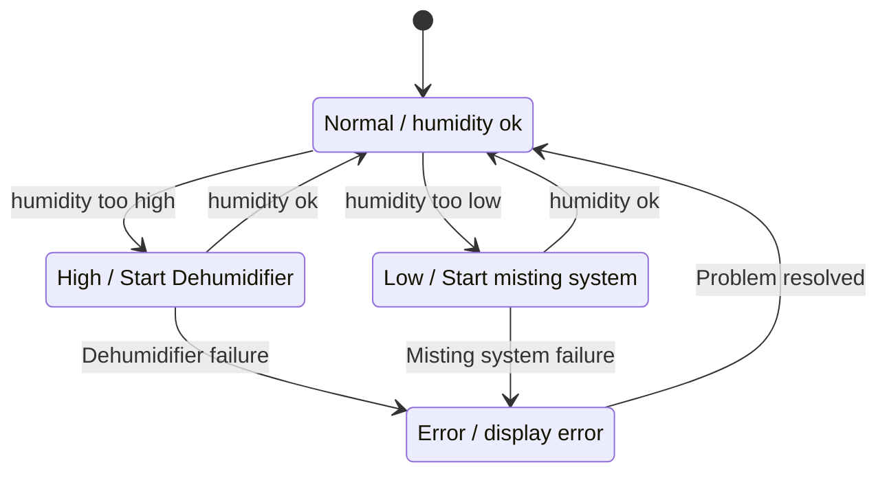

```mermaid
stateDiagram-v2
    [*] --> Normal 
    Normal : Normal / humidity ok
    Normal --> High : humidity too high
    High : High / Start Dehumidifier 
    High --> Normal : humidity ok
    Normal --> Low : humidity too low
    Low : Low / Start misting system
    Low --> Normal : humidity ok
    High --> Error : Dehumidifier failure
    Low --> Error : Misting system failure
    Error : Error / display error
    Error --> Normal : Problem resolved
```
