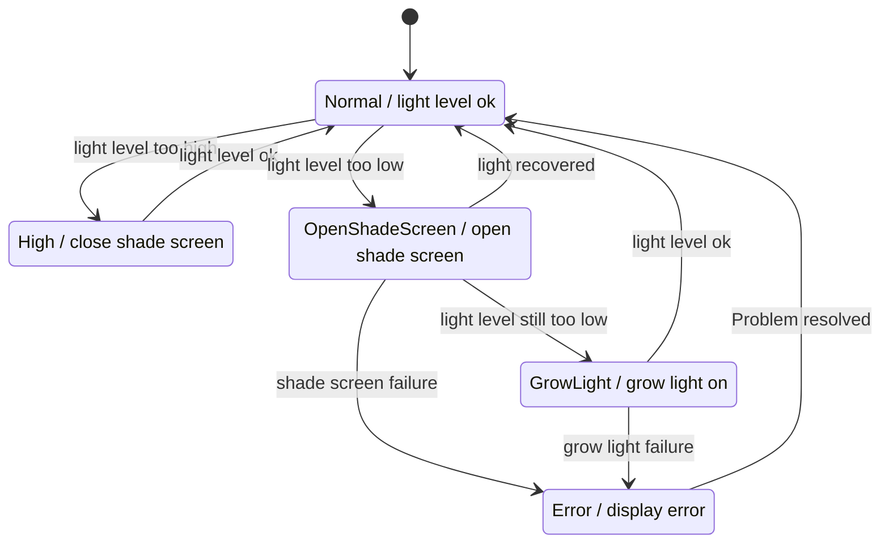

```mermaid
stateDiagram-v2
    [*] --> Normal
    Normal : Normal / light level ok
    Normal --> High : light level too high
    High : High / close shade screen
    High --> Normal : light level ok
    Normal --> OpenShadeScreen : light level too low
    OpenShadeScreen : OpenShadeScreen / open shade screen
    OpenShadeScreen --> GrowLight : light level still too low
    OpenShadeScreen --> Normal : light recovered
    GrowLight --> Normal : light level ok
    GrowLight : GrowLight / grow light on
    OpenShadeScreen --> Error : shade screen failure
    GrowLight --> Error : grow light failure
    Error : Error / display error
    Error --> Normal : Problem resolved
```
