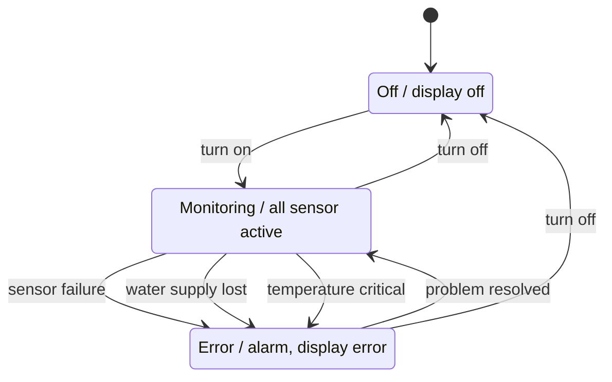

```mermaid
stateDiagram-v2
    [*] --> Off
    Off : Off / display off
    Off --> Monitoring : turn on
    Monitoring : Monitoring / all sensor active
    Monitoring --> Off : turn off
    Monitoring --> Error : sensor failure
    Monitoring --> Error : water supply lost
    Monitoring --> Error : temperature critical
    Error : Error / alarm, display error
    Error --> Monitoring : problem resolved
    Error --> Off : turn off 
```
