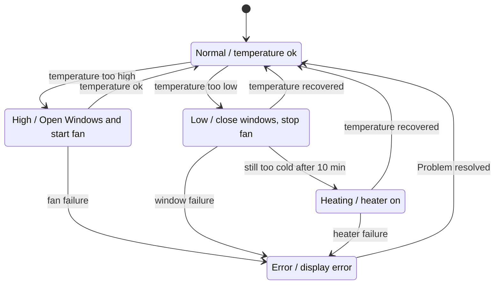

```mermaid
stateDiagram-v2
   [*] --> Normal 
   Normal : Normal / temperature ok
   Normal --> High : temperature too high
   High : High / Open Windows and start fan 
   High --> Normal : temperature ok
   Normal --> Low : temperature too low
   Low : Low / close windows, stop fan
   Low --> Heating : still too cold after 10 min
   Low --> Normal : temperature recovered
   Heating : Heating / heater on
   Heating --> Normal : temperature recovered
   High --> Error : fan failure
   Low --> Error : window failure
   Heating --> Error : heater failure
   Error : Error / display error
   Error --> Normal : Problem resolved
```
