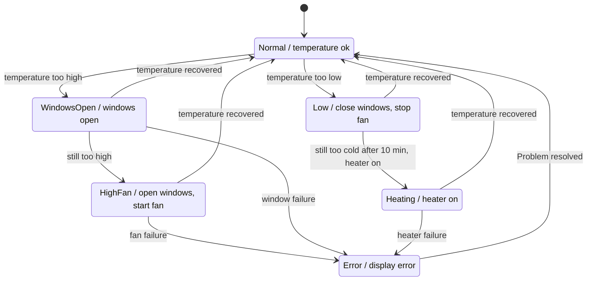

```mermaid
stateDiagram-v2
   [*] --> Normal 
   Normal : Normal / temperature ok
   Normal --> WindowsOpen : temperature too high
   WindowsOpen : WindowsOpen / windows open
   WindowsOpen --> Normal : temperature recovered
   WindowsOpen --> HighFan : still too high
   HighFan : HighFan / open windows, start fan
   HighFan --> Normal : temperature recovered
   HighFan --> Error : fan failure
   WindowsOpen --> Error : window failure
   Normal --> Low : temperature too low
   Low : Low / close windows, stop fan
   Low --> Heating : still too cold after 10 min, heater on
   Low --> Normal : temperature recovered
   Heating : Heating / heater on
   Heating --> Normal : temperature recovered
   Heating --> Error : heater failure
   Error : Error / display error
   Error --> Normal : Problem resolved
```
