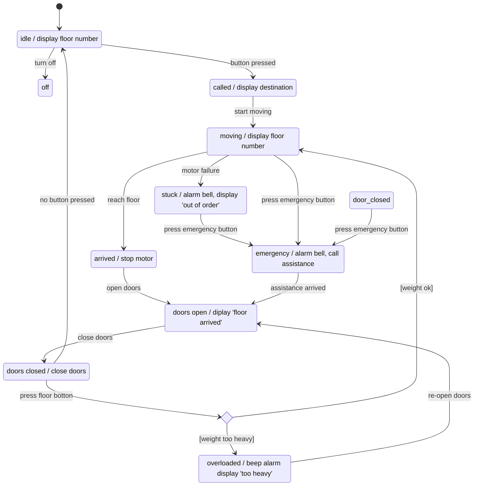

```mermaid
stateDiagram-v2

%% IDLE
[*] --> idle
idle : idle / display floor number
idle --> off : turn off
idle --> called : button pressed

%% CALLED
    called : called / display destination
    called --> moving : start moving

%% MOVING
    moving: moving / display floor number
    moving --> arrived : reach floor
    moving --> stuck : motor failure


%% STUCK
    stuck: stuck / alarm bell, display 'out of order'
    stuck --> emergency : press emergency button

%% ARRIVED
    arrived: arrived / stop motor
    arrived --> doors_open : open doors

%% DOORS OPEN
    doors_open: doors open / diplay 'floor arrived'
    doors_open --> doors_closed : close doors

    
%% DOORS CLOSED
    doors_closed: doors closed / close doors
    

%% CHECK WEIGHT   
  state check_weight <<choice>>
    doors_closed --> check_weight : press floor botton
    check_weight --> moving : [weight ok]
    check_weight --> overloaded : [weight too heavy]

%% OVERLOADED
    overloaded: overloaded / beep alarm display 'too heavy'
    overloaded --> doors_open : re-open doors

%% RETURN TO IDLE
    doors_closed --> idle : no button pressed

%% EMERGENCY
    emergency: emergency / alarm bell, call assistance
    moving --> emergency : press emergency button
    door_closed --> emergency : press emergency button
    emergency --> doors_open : assistance arrived

    

```
