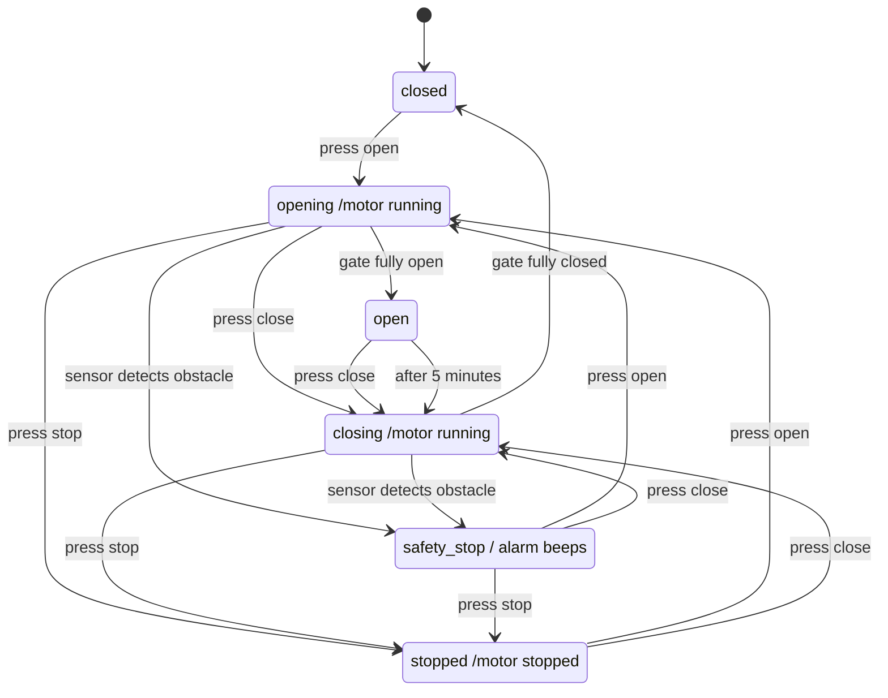

```mermaid
stateDiagram-v2
%% CLOSED
[*] --> closed
  closed --> opening : press open
  opening --> closing : press close
  
%% OPENING
  opening : opening /motor running
  opening --> open : gate fully open
  opening --> stopped : press stop
  opening --> safety_stop : sensor detects obstacle

%% CLOSING
  open --> closing : press close
  closing : closing /motor running
  closing --> closed : gate fully closed
  closing --> stopped : press stop
  closing --> safety_stop : sensor detects obstacle

%% STOPPED 
  stopped : stopped /motor stopped
  stopped --> opening : press open
  stopped --> closing : press close
%% SAFETY STOP
  safety_stop : safety_stop / alarm beeps
  safety_stop --> stopped : press stop
  safety_stop --> opening : press open
  safety_stop --> closing : press close

%% SELF CLOSING
  open --> closing : after 5 minutes
```

