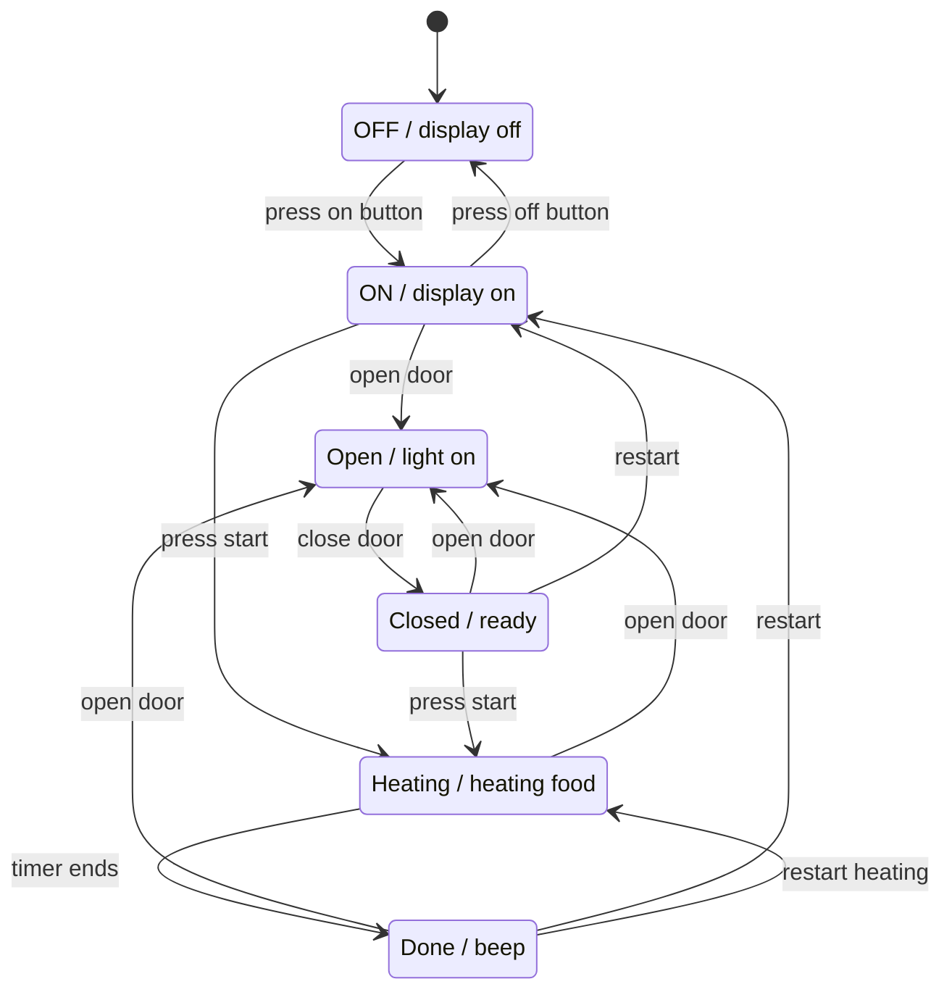

```mermaid
stateDiagram-v2
    [*] --> OFF
    OFF : OFF / display off
    OFF --> ON : press on button
    ON : ON / display on
    ON --> Open : open door
    ON --> OFF : press off button
    ON --> Heating : press start
   
    Open : Open / light on
    Open --> Closed : close door
    
    Closed : Closed / ready
    Closed --> Open : open door
    Closed --> Heating : press start
    Closed --> ON : restart

    Heating : Heating / heating food
    Heating --> Done : timer ends
    Heating --> Open : open door
    
    Done : Done / beep
    Done --> Open : open door
    Done --> ON : restart
    Done --> Heating : restart heating
```
