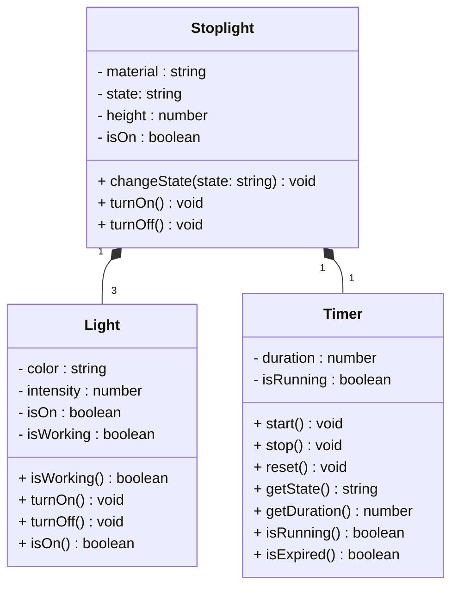

```mermaid
classDiagram
    class Stoplight {
        - material : string
        - state: string
        - height : number
        - isOn : boolean
        + changeState(state: string) void
        + turnOn() void
        + turnOff() void
    }

    class Light {
        - color : string
        - intensity : number
        - isOn : boolean
        - isWorking : boolean
        + isWorking() boolean
        + turnOn() void
        + turnOff() void
        + isOn() boolean
    }
    Stoplight "1" *-- "3" Light

    class Timer {
        - duration : number
        - isRunning : boolean
        + start() void
        + stop() void
        + reset() void
        + getState() string
        + getDuration() number
        + isRunning() boolean
        + isExpired() boolean
    }
    Stoplight "1" *-- "1" Timer
    

    
```
