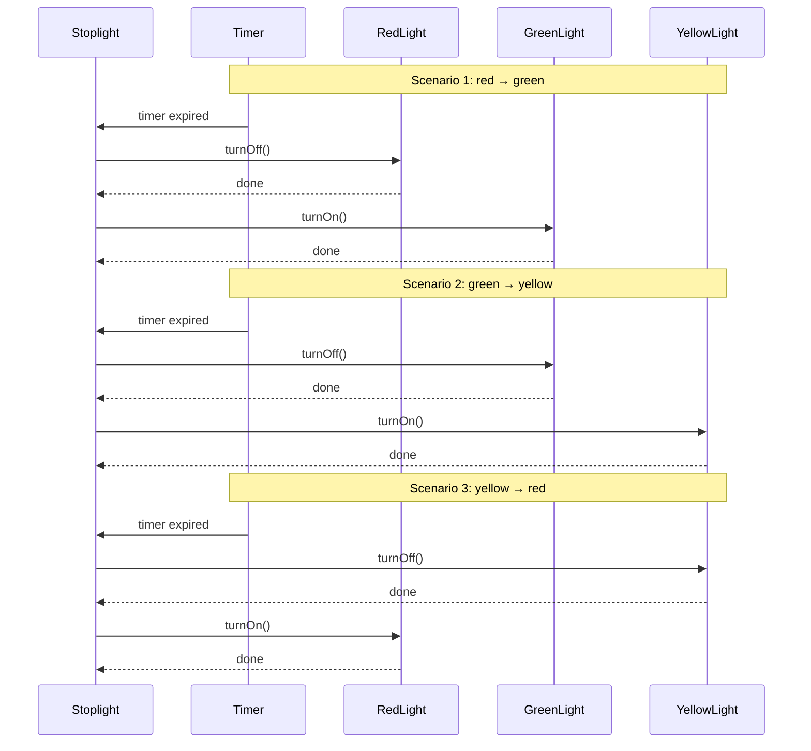

```mermaid
sequenceDiagram
    participant S as Stoplight
    participant T as Timer
    participant R as RedLight
    participant G as GreenLight
    participant Y as YellowLight

    Note over T,Y: Scenario 1: red → green
    T ->> S : timer expired
    S ->> R : turnOff()
    R -->> S : done
    S ->> G : turnOn()
    G -->> S : done

    Note over T,Y: Scenario 2: green → yellow
    T ->> S : timer expired
    S ->> G : turnOff()
    G -->> S : done
    S ->> Y : turnOn()
    Y -->> S : done

    Note over T,Y: Scenario 3: yellow → red
    T ->> S : timer expired
    S ->> Y : turnOff()
    Y -->> S : done
    S ->> R : turnOn()
    R -->> S : done
```