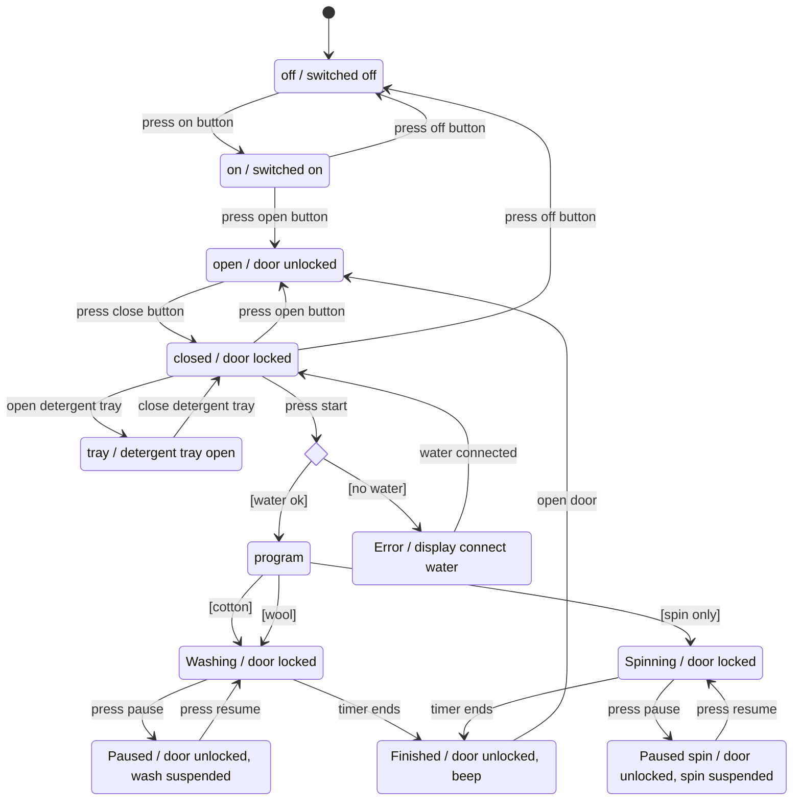

```mermaid
stateDiagram-v2
%%  OFF
    [*] --> off
    off : off / switched off
    off --> on : press on button

%%  ON
    on : on / switched on
    on --> off : press off button
    on --> open : press open button
%%  OPEN
    open : open / door unlocked
    open --> closed : press close button

%%  CLOSED
    closed : closed / door locked
    closed --> open : press open button
    closed --> off : press off button
    closed --> tray : open detergent tray

%%  TRAY
    tray : tray / detergent tray open
    tray --> closed : close detergent tray

%%  WATER
    state check_water <<choice>>
    closed --> check_water : press start
    check_water --> program : [water ok]
    check_water --> Error : [no water]

%%  ERROR
    Error : Error / display connect water
    Error --> closed : water connected

%%  PROGRAM
    state program <<choice>>
    program --> Washing : [cotton]
    program --> Washing : [wool]
    program --> Spinning : [spin only]

%%  WASHING
    Washing : Washing / door locked
    Washing --> Paused : press pause
    Washing --> Finished : timer ends

%%  SPINNING
    Spinning : Spinning / door locked
    Spinning --> Paused_spin : press pause
    Spinning --> Finished : timer ends

%%  PAUSED
    Paused : Paused / door unlocked, wash suspended
    Paused --> Washing : press resume

%%  PAUSED SPIN
    Paused_spin : Paused spin / door unlocked, spin suspended
    Paused_spin --> Spinning : press resume

%%  FINISHED
    Finished : Finished / door unlocked, beep
    Finished --> open : open door
```